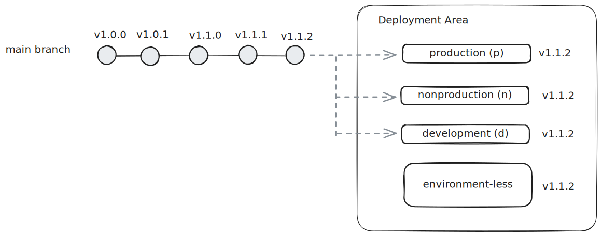
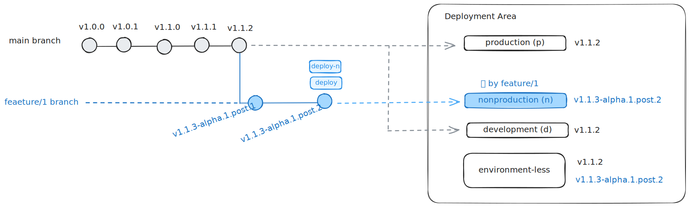
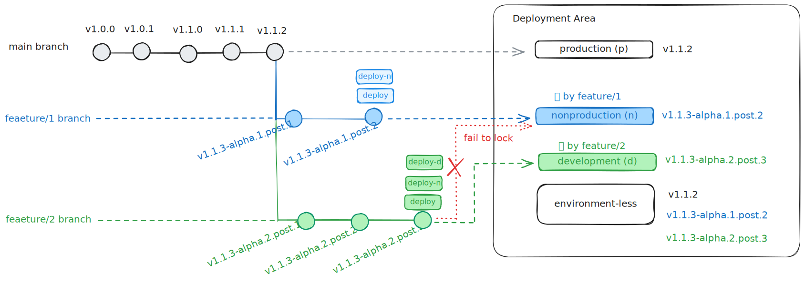

# zerv flow

This repository demonstrates a complete CI/CD solution for multi-environment deployments, integrating the [**zerv**](https://github.com/wislertt/zerv) versioning tool with GitHub Actions for automated versioning and release workflows.

## Overview

**What is zerv?**

- A Rust-based versioning tool that generates semantic versions from git current state (latest tag and current commit)
- Generates versions in multiple formats: semver, pep440, and docker_tag
- Supports flexible branching strategies and version generation rules
- More details can be found at [https://github.com/wislertt/zerv](https://github.com/wislertt/zerv)

**Why use this setup?**

- Automated versioning for multi-environment CI/CD pipelines
- Flexible deployment controls to match your team's speed vs quality needs
- Dynamic GitOps approach: main branch represents all environments by default, PR labels can temporarily shift environment representation to specific branches
- Compatible with popular branching strategies (Trunk-based, GitFlow, Release Trains)

**Quick start**

1. Fork this repository
2. Install zerv locally for testing
3. Create a PR to test the workflow
4. Add `deploy-d`, `deploy-n`, or `deploy` labels to trigger deployments

## Prerequisites

- Main branch tagged with semantic version format (major.minor.patch) - recommend using [semantic-release](https://github.com/semantic-release/semantic-release)
- For multiple long-live branches (e.g., git flow with develop branch): Enable "Require branches to be up to date before merging" protection rule for main branch
- Deployment pipeline must follow function pattern and be idempotent. There are 2 common deployment patterns:
    - `deploy_without_env(repo, versions)`: For immutable releases (e.g., Python packages)
        - Each new version does not override previous versions
        - Example: Publishing to PyPI with incrementing version numbers
    - `deploy_with_env(repo, env_name, versions)`: For environment-specific deployments (e.g., Cloud Run services)
        - New version overrides existing version in specified environment

## Deployment Assumptions for This Repo (Configurable)

- **Environment codes**: d (development), n (nonproduction), p (production) following [GCP landing zone convention](https://docs.cloud.google.com/architecture/blueprints/security-foundations/summary#naming-conventions)
    - Note: These can be configured to any naming convention (e.g., dev/staging/prod)
- **Version formats**: This repository demonstrates 3 formats: - Semver: For git repository tags and releases - PEP440: For Python package versions - Docker Tag: For container registry tags
    - Note: This demo repository only echoes these formats as examples, but in a real deployment pipeline they would be used for their respective purposes.
    - Note: Configure zerv to generate formats based on your deployment requirements and constraints. See [zerv documentation](https://github.com/wislertt/zerv) for all supported formats.

## Branching Strategy Design

- **Core concept**: GitOps approach where branches represent environment states
- **Main branch**: Represents all environments by default, uses semantic version control
- **All non-main branches**: Versioned by zerv when creating PRs
- **Environment representation via PR labels**: Temporarily shifts environment representation from main branch to the PR branch
    - PR with `deploy-d` label = branch represents development environment
    - PR with `deploy-n` label = branch represents nonproduction environment
- **Environment-less deployment trigger**:
    - PR with `deploy` label = deploy without environment using version from the branch (e.g., for immutable releases)
- **Locking mechanism**: Prevents concurrent deployments to same environment
    - First PR with deploy-X label acquires lock for environment X
    - Subsequent PRs with same label fail until lock is released
    - Lock releases when PR merges/closes or label is removed
- **Deployment flow**:
    - PR with label deploys to specific environment immediately
    - When PR merges to main, CD pipeline deploys to ALL environments

## Speed vs Quality Tradeoff

- Flexible deployment controls to match your team's needs
- Example for higher quality nonproduction: Only allow `deploy-n` on `release/*` branches, with required PR reviews before merging to release branch
- Example for fast POC development: Allow `deploy-p` directly in PRs for rapid iteration (accepting potential failures in production environment)
- Adapt the strategy to your context - balance speed vs quality based on your project requirements

## Deployment Flow Examples

The following scenarios demonstrate how the deployment flow works in practice:

- **Initial State**: Only the main branch exists. All environments (development, nonproduction, production) and environment-less deployments reference version `v1.1.2` from the main branch.
  

- **Feature Branch Deployment**: A `feature/1` branch is created with PR labels `deploy-n` and `deploy`. The nonproduction environment deploys version `v1.1.3-alpha.1.post.2` from the feature branch and becomes locked to it. Development and production remain on main branch `v1.1.2`. The environment-less deployment creates a new version `v1.1.3-alpha.1.post.2` without overriding previous versions.
  

- **Concurrent Feature Deployment**: While `feature/1` PR is active, a `feature/2` branch is created with PR labels `deploy-d`, `deploy-n`, and `deploy`. Nonproduction deployment fails due to being locked by `feature/1`. Development deploys successfully with version `v1.1.3-alpha.2.post3` from `feature/2`. Environment-less deployment creates another new version `v1.1.3-alpha.2.post.3` alongside the existing version.
  

## Branch Rules and Version Generation (Configurable)

This repository uses the default branch rules from `zerv flow` command. For complete implementation details, see the shared workflow at [zerv/.github/workflows/shared-zerv-versioning.yml](https://github.com/wislertt/zerv/blob/main/.github/workflows/shared-zerv-versioning.yml).

- **Feature branches** (default): Generate alpha pre-releases with branch-based identification
    - Numbered feature branches (`feature/1/xyz`): Extracts number from branch name
        - Example: `1.0.1-alpha.1.post.1+feature.1.xyz.1.g4e9af24`
    - Non-numbered feature branches (`feature/xyz`): Uses 5-digit hash for identification
        - Example: `1.0.1-alpha.48993.post.1+feature.xyz.3.g4e9af24`
    - Uses commit distance for post count

- **"develop" branch**: Generates beta pre-releases with stable numbering
    - Example: `1.0.1-beta.1.post.1+develop.3.g4e9af24`
    - Uses commit distance for post count

- **"release/\*" branches**: Generates release candidates with extracted or hash-based numbering
    - Regular release branches: `1.0.1-rc.1.post.1.dev.1764382150+release.1.do.something.3.g4e9af24` (full version)
    - With `pre-release` label: `1.0.1-rc.1.post.1` (short version, creates tag)
    - Numbered release branches (`release/1/xyz`): `1.0.1-rc.1.post.1`
    - Non-numbered release branches (`release/xyz`): `1.0.1-rc.48993.post.1` (5-digit hash RC number)
    - Uses tag distance for post count

- **Customization**: All branch rules can be configured with `--branch-rules` argument

## Zerv Flow with Common Branching Strategies

Zerv Flow is designed as a generalized branching framework that builds on top of version generation rules. Rather than being a rigid branching strategy itself, it provides a flexible foundation that's compatible with existing popular branching strategies.

- **Trunk-based / GitHub Flow**:
    - Structure: Main branch + short-lived feature branches
    - Compatible out-of-the-box with default branch rules

- **GitFlow** (Adaptive - not 100% traditional GitFlow):
    - Structure: Main + develop long-lived branches + feature/release/hotfix branches
    - Simplified release branches: `release/1/feature-name` or `release/feature-name` (no manual version bumping needed)
    - Requirements: Enable "Require branches to be up to date before merging" for main branch protection rule
    - Configuration: Update branch rules if develop branch has different name
    - Note: This adapts traditional GitFlow (designed 2010, pre-CI/CD) for modern workflows. Even the author now suggests adapting it to your context: [nvie.com](https://nvie.com/posts/a-successful-git-branching-model/)

- **Release Trains**:
    - Structure: Main + develop as accumulation branch, feature branches from develop, periodic releases
    - Process: Create release branches from develop on schedule, merge to main for releases
    - Requirements: Enable "Require branches to be up to date before merging" for main branch protection rule

- **GitLab Flow (Environment Branches)**:
    - Note: Not designed to support this strategy by default
    - Could work with custom configuration but considered out of scope for this framework

## Contributing

Contributions are welcome! Please feel free to submit a Pull Request. For major changes, please open an issue first to discuss what you would like to change.

## License

This project is licensed under the Apache License 2.0 - see the [LICENSE](LICENSE) file for details.
